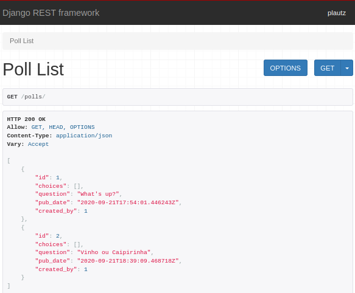
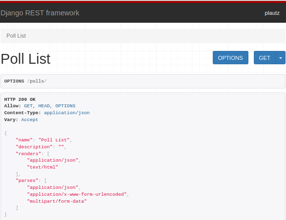
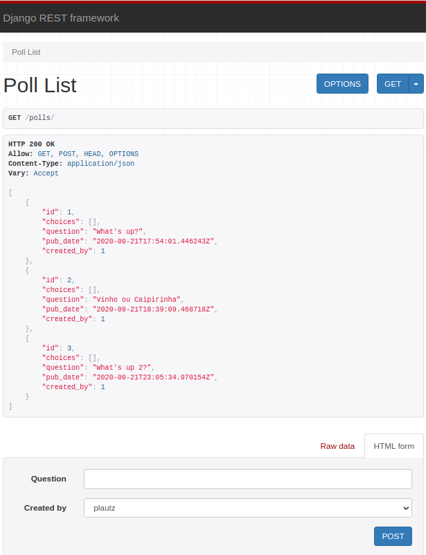

# pollsapi
Project based on book Building Apis with Django and Django Rest Framework


[](https://pyup.io/repos/github/jlplautz/pollsapi/)
[](https://pyup.io/repos/github/jlplautz/pollsapi/)

## 2- Create virtual environment
   - pollsapi $ pipenv install django
   - pollsapi $ pipenv install djangorestframework
   - pollsapi $ pipenv shell
   - (pollsapi) pollsapi $ pipenv install flake8
   - (pollsapi) pollsapi $ pip freeze > requirements.txt
   ```
   (pollsapi) pollsapi $ tree
    .
    ├── LICENSE
    ├── Pipfile
    ├── Pipfile.lock
    ├── README.md
    └── requirements.txt
   ```
   - file .flake8
   ```
   [flake8]
   max-line-length = 120
   exclude = .venv
   ```
   - file .pyup.yml
   ```
   requirements:
      - Pipfile
      - Pipfile.lock
   ```   

## 2.1- Create a project
   - (pollsapi) pollsapi $ django-admin startproject pollsapi

## 2.2- Create setup
   - pollsapi/settings.py file would already have the correct settings
   - (pollsapi) pollsapi $ python manage.py migrate
   
## 2.3- Create models

   - (pollsapi) pollsapi $ python manage.py startapp polls
   ```
   (pollsapi) pollsapi $ pwd
   /home/plautz/PycharmProjects/pollsapi/pollsapi
   (pollsapi) pollsapi $ tree
   .
   ├── db.sqlite3
   ├── manage.py
   ├── Pipfile
   ├── Pipfile.lock
   ├── polls
   │   ├── admin.py
   │   ├── apps.py
   │   ├── __init__.py
   │   ├── migrations
   │   │   └── __init__.py
   │   ├── models.py
   │   ├── tests.py
   │   └── views.py
   └── pollsapi
       ├── asgi.py
       ├── __init__.py
       ├── __pycache__
       │   ├── __init__.cpython-38.pyc
       │   ├── settings.cpython-38.pyc
       │   └── urls.cpython-38.pyc
       ├── settings.py
       ├── urls.py
       └── wsgi.py
   ```

## 2.4- Active models

   - To create the database tables to our models,‘rest_framework’ and ‘polls’ app needs to be added 
     to the “INSTALLED_APPS” in the ‘django_pollsapi/settings’ file.
   ```
    INSTALLED_APPS = (
    ...
    'rest_framework',
    'polls',
    )
   ```
   - (pollsapi) pollsapi $ python manage.py makemigrations polls
   ```
   Migrations for 'polls':
     polls/migrations/0001_initial.py
       - Create model Poll
       - Create model Choice
       - Create model Vote
   ```
   - (pollsapi) pollsapi $ python manage.py migrate
   - created a file polls/urls.py 
   - include the polls urls pollsapi/urls.py
   ```
   from django.contrib import admin
   from django.urls import path, include
    urlpatterns = [
        path('admin/', admin.site.urls),
        path('', include('polls.urls'))
    ]
   ```
# 3- A simple API with pure Django

## 3.1- The endpoints and the URLS
   - Our API will have two endpoints returning data in JSON format.
      - /polls/ GETs list of Poll
      - /polls/<id>/ GETs data of a specific Poll
      
## 3.2- Connecting urls to the views 
   - Write two place holder view functions and connect them in your urls.py. 
     We will finish polls_list and polls_detail shortly.
     
## 3.3- Created SuperUser
   - (pollsapi) pollsapi $ python manage.py createsuperuser
     Username (leave blank to use 'plautz'): 
     Email address: jorge.plautz@gmail.com
     Password: 
     Password (again): 
     This password is too short. It must contain at least 8 characters.
     This password is too common.
     Bypass password validation and create user anyway? [y/N]: y
     Superuser created successfully.

# 4- Serializing and Deserializing Data

## 4.2- Creating Serializers
   - Create a file polls/serializers.py
   ```
    from rest_framework import serializers
    from .models import Poll, Choice, Vote
    class VoteSerializer(serializers.ModelSerializer):
    class Meta:
        model = Vote
        fields = '__all__'
    class ChoiceSerializer(serializers.ModelSerializer):
        votes = VoteSerializer(many=True, required=False)
        class Meta:
            model = Choice
            fields = '__all__'
    class PollSerializer(serializers.ModelSerializer):
        choices = ChoiceSerializer(many=True, read_only=True, required=False)
        class Meta:
            model = Poll
            fields = '__all__'
   ```
   
## 4.4-  Using PollSerializer
   - >>> from polls.serializers import PollSerializer
   - >>> from polls.models import Poll
   - >>> poll_serializer = PollSerializer(data={"question": "Vinho ou Caipirinha", "created_by": 1})
   - >>> poll_serializer.is_valid()
     - True
   - >>>> poll = poll_serializer.save()
   - >>> poll.pk
     - 2
   - >>> Poll.objects.all()
     - <QuerySet [<Poll: What's up?>, <Poll: Vinho ou Caipirinha>]>
   - >>>> Poll.objects.get(pk=1)
     - <Poll: What's up?>


## 5- Creating Views with APIView

   - Create a file polls/apiviews.py
   ```
    from rest_framework.views import APIView
    from rest_framework.response import Response
    from django.shortcuts import get_object_or_404
    from .models import Poll, Choice
    from .serializers import PollSerializer

    class PollList(APIView):
       def get(self, request):
           polls = Poll.objects.all()[:20]
          data = PollSerializer(polls, many=True).data
          return Response(data)

    class PollDetail(APIView):
       def get(self, request, pk):
          poll = get_object_or_404(Poll, pk=pk)
          data = PollSerializer(poll).data
          return Response(data)

   ```

    -  change file urls.py
    
   ```
    from django.urls import path
    # from .views import polls_list, polls_detail
    from .apiviews import PollList, PollDetail

    urlpatterns = [
    path("polls/", PollList.as_view(), name="polls_list"),
    path("polls/<int:pk>/", PollDetail.as_view(), name="polls_detail")
    ]
   ```
    
   - to acess -> http://localhost:8000/polls/





## 5.2- Using DRF generic views
   - change apiviews.py to the below code, and leave urls.py as is.
   ```
    from rest_framework import generics
    from .models import Poll, Choice
    from .serializers import PollSerializer, ChoiceSerializer,VoteSerializer

    class PollList(generics.ListCreateAPIView):
        queryset = Poll.objects.all()
        serializer_class = PollSerializer

    class PollDetail(generics.RetrieveDestroyAPIView):
        queryset = Poll.objects.all()
        serializer_class = PollSerializer
   ```




## 5.3- More generic views
   - insert apiviews.py to the below code, and insert into urls.py as is.
   ```
    class ChoiceList(generics.ListCreateAPIView):
        queryset = Choice.objects.all()
        serializer_class = ChoiceSerializer

    class CreateVote(generics.CreateAPIView):
        serializer_class = VoteSerializer
   ```
   - and insert into urls.py as is.
   ```
    from .apiviews import PollList, PollDetail, ChoiceList, CreateVote
       path("choices/", ChoiceList.as_view(), name="choice_list"),
       path("vote/", CreateVote.as_view(), name="create_vote"),
   ```